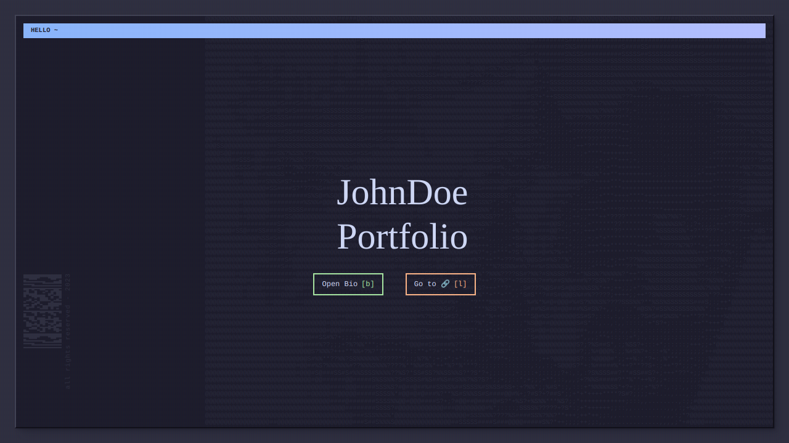

# Astro Tailwind Portfolio


## Description

Astro Tailwind Portfolio is a personal website built with Astro, Tailwind, Partytown, Playwright, ESLint, TypeScript, and Prettier. You are free to customize it the way you like 🎉!

## Prerequisites

Ensure you have the following installed on your system:

- [Node.js](https://nodejs.org/en)
- [pnpm](https://pnpm.io/installation)

## 🚀 Getting Started

Follow these steps to set up a local development environment:

1. Clone the repository: `git clone git@github.com:clementsirieix/astro-tailwind-portfolio.git`
2. Navigate into the project directory: `cd portfolio-v3`
3. Install dependencies with pnpm: `pnpm install`
4. Run the website locally: `pnpm run dev`

## Configuration

Rename the `.env.default` file to `.env` and add the appropriate values. Additional configuration can be added in the `src/config.ts` file.

## Adding Content

### Projects

To add a new project, create a new .json file in the `src/content/project/production` directory. Here's an example of the structure:

```json
{
  "name": "Project Name",
  "icon": "./icons/icon_1.png",
  "iconAlt": "Alt Text",
  "link": "https://www.github.com",
  "date": "MM/DD/YYYY"
}
```

### Posts

To add a new post, create a new .mdx file in the src/content/blog/production directory. Here's an example of the structure:

```mdx
---
createdAt: YYYY-MM-DD
---

# Title

Your post content here.
```

## Testing

Testing is performed using ESLint, Astro check, TypeScript, and Playwright. Run `pnpm run test` to execute all tests.

## Deploying

You can deploy in a few clicks using [Netlify](https://docs.astro.build/en/guides/deploy/netlify/).

## Contributing

Contributions are welcome! If you need help or have any questions, please open an issue.

## Screenshots




## License

This project is licensed under the terms of the MIT license.

## Extra

- In `robots.txt` update the sitemap domain with your own domain.
- In `public/tag-img` replace with your own pictures.
